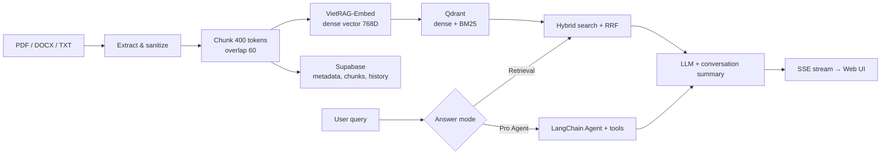

# MyNotebook

MyNotebook is a document question-answering application built around
Retrieval-Augmented Generation (RAG). It accepts PDF, DOCX, and TXT files, indexes
their content per user and conversation, retrieves context through hybrid search,
and streams generated answers to the web interface.

## System architecture



### Document ingestion workflow

1. The API receives a file and selects an extractor from its extension.
2. The extracted content is sanitized and split with
   `RecursiveCharacterTextSplitter` using a 400-token chunk size and a 60-token
   overlap.
3. `VietRAG-Embed` produces normalized 768-dimensional dense embeddings.
4. Metadata, chunks, and conversation history are stored in Supabase.
5. Qdrant stores dense vectors, sparse BM25 vectors, and the `user_id`, `chat_id`,
   and `document_id` payload. The pipeline writes batches of up to 200 chunks.

### Question-answering workflow

In Retrieval mode, the query is embedded and searched in Qdrant. Dense semantic
results and sparse BM25 results are combined with Reciprocal Rank Fusion (RRF).
Filters on `user_id` and `chat_id` restrict retrieval to the current workspace.
Retrieved passages and the conversation summary are sent to the LLM, and the
answer is streamed through Server-Sent Events (SSE).

Agent mode requires a `Pro` plan. The agent is built with LangChain
`create_agent`, is limited to 10 tool calls per run, and provides these tools:

- `qdrant_query`: searches the user's documents through hybrid retrieval.
- `web_search`: searches the web through DDGS with fallback across multiple
  backends.
- `Calculator`: performs calculations through the `llm-math` tool.
- `ocr_image`: sends an image to a vision LLM and returns the recognized text.

After each turn, the system updates both the conversation summary and the complete
conversation in Supabase to support follow-up questions.

## Main modules

| Module | Responsibility |
|---|---|
| `BackEnd/app/main.py` | Initializes FastAPI, registers routers, and serves the static frontend |
| `BackEnd/app/api/` | Exposes document upload, chat history, and SSE retrieval endpoints |
| `BackEnd/app/pipeline.py` | Coordinates ingestion, retrieval, LLM/Agent execution, and history updates |
| `BackEnd/app/doc_extractor/` | Extracts PDF/DOCX/TXT files, sanitizes text, and performs recursive chunking |
| `BackEnd/app/text_input/Embedding.py` | Lazy-loads `nhminh107/VietRAG-Embed` and encodes passages and queries |
| `BackEnd/app/database/qdrant_manager.py` | Implements Qdrant hybrid search with dense cosine, BM25, RRF, and tenant filters |
| `BackEnd/app/database/sql_manager.py` | Accesses Supabase users, documents, chunks, and chat history |
| `BackEnd/app/chatbot/chatbot.py` | Defines the RAG prompt, streams LLM output, and summarizes conversations |
| `BackEnd/app/chatbot/agents.py` | Implements the Pro LangChain Agent and tool orchestration |
| `BackEnd/app/chatbot/tools.py` | Provides document search, web search, calculator, and OCR tools |
| `BackEnd/app/query_router/` | Contains the `DIRECTS/RETRIEVE` classifier; it is not connected to the main API yet |
| `BackEnd/app/database/faiss_manager.py` | Provides a local FAISS store for the experimental text-input flow, not the primary retriever |
| `FrontEnd/` | Provides the HTML/CSS/JavaScript interface, Markdown rendering, and SSE handling |
| `Benchmark/` | Contains accuracy, cold/warm latency, retrieval, router, and live E2E benchmarks |

## Main API endpoints

| Method | Endpoint | Purpose |
|---|---|---|
| `GET` | `/health` | Checks API availability |
| `POST` | `/documents/upload` | Uploads and indexes a PDF, DOCX, or TXT file |
| `POST` | `/documents/retrieval/stream` | Runs RAG question answering and returns SSE |
| `POST` | `/documents/retrieval/agent-stream` | Runs Agent-based question answering for a Pro account |
| `GET` | `/documents/chats/{user_id}` | Lists a user's conversations |
| `GET` | `/documents/chats/{user_id}/{chat_id}` | Returns a conversation and its documents |

Swagger UI is available at `http://localhost:8000/docs` while the application is
running.

## Configuration

Create `BackEnd/.env` from the example and provide the required credentials:

```bash
cp BackEnd/.env.example BackEnd/.env
```

```dotenv
SUPABASE_URL=https://YOUR_PROJECT.supabase.co
SUPABASE_PUBLISHABLE_KEY=YOUR_SUPABASE_KEY
LLM_API_KEY=YOUR_LLM_API_KEY
OCR_API_KEY=YOUR_OCR_API_KEY
```

`OCR_API_KEY` is only required for OCR. Supabase must provide tables compatible
with the current models: `user`, `document`, `chunks`, and `chat_history`. Never
commit the `.env` file.

Qdrant is expected at `http://localhost:6333` by default. The `user_documents`
collection is created automatically when the pipeline is initialized.

## Running with Docker on Ubuntu

The Dockerfile packages the API and frontend only. Qdrant runs in a separate
container, while Supabase is accessed through the URL in `.env`. Because the
current configuration uses `localhost:6333`, both containers must use host
networking.

### 1. Start Qdrant

```bash
docker volume create mynotebook_qdrant

docker run -d \
  --name mynotebook-qdrant \
  --network host \
  -v mynotebook_qdrant:/qdrant/storage \
  qdrant/qdrant:latest
```

Check Qdrant:

```bash
curl http://localhost:6333/healthz
```

### 2. Build the application

Run from the repository root:

```bash
docker build -t mynotebook:local .
```

### 3. Start the API and web interface

```bash
docker run --rm \
  --name mynotebook-api \
  --network host \
  --env-file BackEnd/.env \
  mynotebook:local
```

Open:

- Web UI: `http://localhost:8000`
- Swagger: `http://localhost:8000/docs`
- Health check: `http://localhost:8000/health`

The first initialization may take longer because the embedding and BM25 models
must be downloaded and loaded into memory. If the container has no Internet
access, the models must already be included in the image or provided through a
mounted cache.

Stop the services:

```bash
docker stop mynotebook-api mynotebook-qdrant
```

The API container uses `--rm`, so it is removed after stopping. Qdrant data remains
in the `mynotebook_qdrant` volume.

## Running directly from the virtual environment

The project uses the virtual environment at `BackEnd/.venv`:

```bash
BackEnd/.venv/bin/uvicorn BackEnd.app.main:app \
  --host 0.0.0.0 \
  --port 8000
```

Qdrant must still be running on port 6333, and `BackEnd/.env` must be configured
before starting the application.

## Tests and benchmarks

```bash
BackEnd/.venv/bin/python -m pytest -q BackEnd/app/tests
BackEnd/.venv/bin/python Benchmark/run_benchmark.py offline
BackEnd/.venv/bin/python Benchmark/run_benchmark.py local
BackEnd/.venv/bin/python Benchmark/run_benchmark.py live \
  --config Benchmark/config.example.toml
```

The benchmark covers retrieval metrics, answer metrics, embedding cold/warm
latency, router accuracy, extractors, TTFT, p50/p95/p99, and throughput. See
[`Benchmark/README.md`](Benchmark/README.md) for metric definitions and result
interpretation.

### Benchmark snapshot

The latest local benchmark was executed on CPU with the real VietRAG embedding
model. The retrieval fixture contains three focused passages and three matching
queries; these results are intended as a reproducible component baseline rather
than a production-scale quality claim.

| Area | Metric | Result |
|---|---|---:|
| Document processing | PDF/DOCX/TXT extraction mean | 5.00 ms |
| Document processing | Extraction p95 | 6.40 ms |
| Embedding | Model cold start | 4.19 s |
| Embedding | Warm query mean | 4.63 ms |
| Embedding | Warm query p50 | 4.52 ms |
| Embedding | Warm query p95 | 5.06 ms |
| Retrieval | Hit Rate@3 | 1.00 |
| Retrieval | Recall@3 | 1.00 |
| Retrieval | MRR | 1.00 |

All three gold passages were ranked first for their corresponding queries, giving
an MRR of 1.00. Once loaded, the embedding model processed a short query in about
4.6 ms on average, while the extractor suite handled all three supported document
formats with a p95 below 6.5 ms on the compact test fixtures.

The deterministic offline suite also completed all five component checks,
covering text sanitization, SSE formatting, retrieval and answer metric
calculation, and the FAISS add/search/persist/rollback lifecycle. The benchmark's
own unit test suite completed all six tests successfully.

## Current status and limitations

- The Query Router has a trained model but is not part of the current API flow.
- The Qdrant API path returns concatenated context rather than chunk IDs and
  scores, so retrieval traces are not currently exposed.
- The benchmark found that the TXT and DOCX extractors return the `text` key while
  the pipeline expects `texts`. These upload paths must be fixed before production
  use.
- `TextInputProcessor` currently creates a `Document` without the required
  `chat_id`; the corresponding test fails.
- The router model was saved with scikit-learn 1.8.0, while the current environment
  uses 1.9.1. It should be retrained or exported again to avoid compatibility
  warnings.
