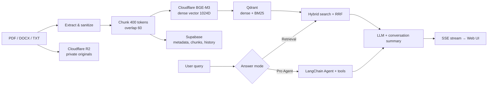

# MyNotebook

MyNotebook is a document question-answering application built around
Retrieval-Augmented Generation (RAG). It accepts PDF, DOCX, and TXT files, indexes
their content per user and conversation, retrieves context through hybrid search,
and streams generated answers to the web interface.

## System architecture


```mermaid
flowchart LR
    U["PDF / DOCX / TXT"] --> E["Extract & sanitize"]
    U --> R2["Cloudflare R2<br/>private originals"]
    E --> C["Chunk 400 tokens<br/>overlap 60"]
    C --> V["Cloudflare BGE-M3<br/>dense vector 1024D"]
    C --> S["Supabase<br/>metadata, chunks, history"]
    V --> Q["Qdrant<br/>dense + BM25"]

    X["User query"] --> M{"Answer mode"}
    M -->|Retrieval| H["Hybrid search + RRF"]
    M -->|Pro Agent| A["LangChain Agent + tools"]
    Q --> H
    H --> L["LLM + conversation summary"]
    A --> L
    L --> O["SSE stream → Web UI"]
```

### Document ingestion workflow

1. The API receives a file and selects an extractor from its extension.
2. The extracted content is sanitized and split with
   `RecursiveCharacterTextSplitter` using a 400-token chunk size and a 60-token
   overlap.
3. Cloudflare Workers AI `@cf/baai/bge-m3` produces normalized 1024-dimensional
   dense embeddings without E5 query/passage prefixes.
4. Metadata, chunks, and conversation history are stored in Supabase.
5. Qdrant stores dense vectors, sparse BM25 vectors, and the `user_id`, `chat_id`,
   and `document_id` payload. The pipeline writes batches of up to 200 chunks.

### Question-answering workflow

In Retrieval mode, the query is embedded and searched in Qdrant. Dense semantic
results and sparse BM25 results are combined with Reciprocal Rank Fusion (RRF).
Filters on `user_id` and `chat_id` restrict retrieval to the current workspace.
Retrieved passages and the conversation summary are sent to the LLM, and the
answer is streamed through Server-Sent Events (SSE).

Agent mode requires a `Pro` plan. The agent is built with LangChain
`create_agent`, is limited to 10 tool calls per run, and provides these tools:

- `qdrant_query`: searches the user's documents through hybrid retrieval.
- `web_search`: searches the web through DDGS with fallback across multiple
  backends.
- `Calculator`: performs calculations through the `llm-math` tool.
- `ocr_image`: sends an image to a vision LLM and returns the recognized text.

After each turn, the system updates both the conversation summary and the complete
conversation in Supabase to support follow-up questions.

## Main modules

| Module | Responsibility |
|---|---|
| `BackEnd/app/main.py` | Initializes FastAPI, registers routers, and serves the static frontend |
| `BackEnd/app/api/` | Exposes document upload, chat history, and SSE retrieval endpoints |
| `BackEnd/app/pipeline.py` | Coordinates ingestion, retrieval, LLM/Agent execution, and history updates |
| `BackEnd/app/doc_extractor/` | Extracts PDF/DOCX/TXT files, sanitizes text, and performs recursive chunking |
| `BackEnd/app/text_input/Embedding.py` | Calls Cloudflare BGE-M3 and normalizes 1024-dimensional passage/query vectors |
| `BackEnd/app/database/qdrant_manager.py` | Implements Qdrant hybrid search with dense cosine, BM25, RRF, and tenant filters |
| `BackEnd/app/database/sql_manager.py` | Accesses Supabase users, documents, chunks, and chat history |
| `BackEnd/app/chatbot/chatbot.py` | Defines the RAG prompt, streams LLM output, and summarizes conversations |
| `BackEnd/app/chatbot/agents.py` | Implements the Pro LangChain Agent and tool orchestration |
| `BackEnd/app/chatbot/tools.py` | Provides document search, web search, calculator, and OCR tools |
| `BackEnd/app/query_router/` | Contains the `DIRECTS/RETRIEVE` classifier; it is not connected to the main API yet |
| `BackEnd/app/database/faiss_manager.py` | Provides a local FAISS store for the experimental text-input flow, not the primary retriever |
| `FrontEnd/` | Provides the HTML/CSS/JavaScript interface, Markdown rendering, and SSE handling |
| `Benchmark/` | Contains accuracy, cold/warm latency, retrieval, router, and live E2E benchmarks |

## Main API endpoints

| Method | Endpoint | Purpose |
|---|---|---|
| `GET` | `/health` | Checks API availability |
| `POST` | `/documents/upload` | Uploads and indexes a PDF, DOCX, or TXT file |
| `GET` | `/documents/files/{document_id}` | Authorizes the owner and redirects to the configured public or signed R2 URL |
| `POST` | `/documents/retrieval/stream` | Runs RAG question answering and returns SSE |
| `POST` | `/documents/retrieval/agent-stream` | Runs Agent-based question answering for a Pro account |
| `GET` | `/documents/chats/{user_id}` | Lists a user's conversations |
| `GET` | `/documents/chats/{user_id}/{chat_id}` | Returns a conversation and its documents |

Swagger UI is available at `http://localhost:8000/docs` while the application is
running.

## Document source citations

Answers can include clickable document references with filename, PDF page, and
the extracted snippet. Source snapshots persist with each conversation turn.
The additive chunk metadata migration enables SQL metadata storage; uploads also
support the previous schema. Log in again to obtain the signed document-access session. See
[`BackEnd/SOURCE_CITATIONS.md`](BackEnd/SOURCE_CITATIONS.md) for setup, the SSE
contract, legacy metadata handling, and access-controlled retrieval diagnostics.

## Configuration

Create `BackEnd/.env` from the example and provide the required credentials:

```bash
cp BackEnd/.env.example BackEnd/.env
```

```dotenv
SUPABASE_URL=https://YOUR_PROJECT.supabase.co
SUPABASE_PUBLISHABLE_KEY=YOUR_SUPABASE_KEY
LLM_API_KEY=YOUR_LLM_API_KEY
OCR_API_KEY=YOUR_OCR_API_KEY
CF_API_KEY=YOUR_CLOUDFLARE_API_TOKEN
CF_ACC_ID=YOUR_CLOUDFLARE_ACCOUNT_ID
S3_API_KEY=YOUR_CLOUDFLARE_R2_API_TOKEN
S3_API_URL=https://YOUR_CLOUDFLARE_ACCOUNT_ID.r2.cloudflarestorage.com
S3_PUBLIC_URL=https://pub-YOUR_BUCKET_ID.r2.dev
```

`OCR_API_KEY` is only required for OCR. Supabase must provide tables compatible
with the current models: `user`, `document`, `chunks`, and `chat_history`. Never
commit the `.env` file.

`S3_API_KEY` must be a Cloudflare R2 API Token with Object Read & Write access to
the existing `mynotebook` bucket. Uploads archive originals there. When
`S3_PUBLIC_URL` is configured, citation and sidebar links simply append the stored
object key to that public bucket URL, without signatures or expiry. Use the
enabled public `r2.dev` URL or a custom domain, not the S3 API endpoint. Without
this optional setting, private links are signed for one hour. The stable authenticated
backend file route redirects old links to Cloudflare. Apply
[`002_document_storage.sql`](BackEnd/migrations/002_document_storage.sql) before
R2 uploads; see the [migration instructions](BackEnd/migrations/README.md).
The backend uses boto3 with the R2 S3 endpoint specified by `S3_API_URL` (or the
default derived from `CF_ACC_ID`) and credentials derived from the API token.

Qdrant is expected at `http://localhost:6333` by default. The `user_documents`
collection is created automatically with 1024-dimensional dense vectors when the
pipeline is initialized. An existing 768-dimensional collection cannot accept
BGE-M3 vectors; back it up and rebuild it with newly embedded documents before
using the new model.

## Running with Docker on Ubuntu

The Dockerfile packages the API and frontend only. Qdrant runs in a separate
container, while Supabase is accessed through the URL in `.env`. Because the
current configuration uses `localhost:6333`, both containers must use host
networking.

### 1. Start Qdrant

```bash
docker volume create mynotebook_qdrant

docker run -d \
  --name mynotebook-qdrant \
  --network host \
  -v mynotebook_qdrant:/qdrant/storage \
  qdrant/qdrant:latest
```

Check Qdrant:

```bash
curl http://localhost:6333/healthz
```

### 2. Build the application

Run from the repository root:

```bash
docker build -t mynotebook:local .
```

### 3. Start the API and web interface

```bash
docker run --rm \
  --name mynotebook-api \
  --network host \
  --env-file BackEnd/.env \
  mynotebook:local
```

Open:

- Web UI: `http://localhost:8000`
- Swagger: `http://localhost:8000/docs`
- Health check: `http://localhost:8000/health`

The first initialization may take longer because the embedding and BM25 models
must be downloaded and loaded into memory. If the container has no Internet
access, the models must already be included in the image or provided through a
mounted cache.

Stop the services:

```bash
docker stop mynotebook-api mynotebook-qdrant
```

The API container uses `--rm`, so it is removed after stopping. Qdrant data remains
in the `mynotebook_qdrant` volume.

## Running directly from the virtual environment

The project uses the virtual environment at `BackEnd/.venv`:

```bash
BackEnd/.venv/bin/uvicorn BackEnd.app.main:app \
  --reload \
  --host 0.0.0.0 \
  --port 8000
```

Qdrant must still be running on port 6333, and `BackEnd/.env` must be configured
before starting the application.

## Tests and benchmarks

The real-document benchmark uses four local PDFs from `/home/nhminh/Documents`.
The original files are read-only and are not copied into the repository. The
[document manifest](Benchmark/datasets/documents.json) records SHA-256 checksums
and physical PDF page counts; the [gold dataset](Benchmark/datasets/document_qa.json)
contains 60 manually curated questions, reference answers, required facts and
page-specific evidence quotes.

| Source | Pages | Role |
|---|---:|---|
| `s11432-025-4676-4.pdf` | 40 | English technical survey, numbers, cross-language questions |
| `bt_deeplearning_chuong6-7.pdf` | 16 | Vietnamese learning material, regularization, tables and answer checks |
| AI Challenge research report in `ToanKe/` | 14 | Vietnamese retrieval report, task comparisons and scoring examples |
| English summer revision worksheet, paper 1 | 3 | Questions and answer key on separate pages |

There are 10 development cases and 50 held-out test cases. Test comprises 44
answerable cases and 6 unanswerable cases; answerable categories include factual,
paraphrase, cross-language, table lookup, answer key and multi-hop questions. Source
facts are evaluated as stated in the supplied PDFs, including the AI-generated
research report. Independent human review of the labels remains pending.

Activate the required Conda environment before running Python:

```bash
source ~/miniconda3/etc/profile.d/conda.sh
conda activate DL_Env
python -m pytest -q Benchmark/tests BackEnd/app/tests/test_text_sanitizer.py
python Benchmark/run_benchmark.py corpus --split test --k 5 --iterations 3
```

For a CI gate, add `--fail-on-threshold`. Reports in `Benchmark/results/` contain
JSON metrics, ranked evidence per question, category breakdowns and Markdown.
`Benchmark/workspace/chunks.json` exposes stable local chunk IDs for exported
prediction scoring. Both directories are ignored; PDFs are not added to Git.

### Real-document baseline (2026-10-08)

This is a **CPU lexical BM25 retrieval baseline**, using Poppler text-layer
extraction and the application's real recursive chunker/tokenizer (400 tokens,
60-token overlap). It does not measure the production Qdrant hybrid retriever or
LLM. The whole 73-page corpus is indexed, including non-gold distractor pages.
Quality is scored once per question; latency uses three measured repetitions
with the first request and one warm-up excluded.

| Metric | Measured result |
|---|---:|
| Corpus | 4 PDFs / 73 pages / 275 chunks |
| Evaluated questions | 50 test / 44 answerable |
| Page Hit Rate@5 | 0.8409 |
| Page Recall@5 | 0.8159 |
| Page Precision@5 | 0.1727 |
| MRR@5 | 0.7534 |
| Page nDCG@5 | 0.6781 |
| Exact evidence quote coverage@5 | 0.7045 |
| Warm retrieval mean | 0.1138 ms |
| Warm retrieval p95 | 0.1959 ms |
| Corpus preparation, including tokenizer import | 8.63 s |
| Index build | 18.23 ms |

**Result: FAIL** against the initial Page Recall@5 gate of 0.75. Cross-language
questions have page recall 0.00; multi-hop questions have 0.25. These values are
recorded without tuning the held-out test set. Multiple chunks from the same
page consume retrieval slots but receive relevance credit only once. Page-level
relevance is weaker than exact evidence support, so quote coverage is reported
separately. Negative cases are excluded from positive retrieval metrics and
require actual answers to measure abstention.

The [saved baseline report](Benchmark/baselines/corpus-bm25-20261008.md) contains
all per-question rankings. Older perfect scores on three synthetic passages are
historical smoke checks and do not represent this corpus or the current
Cloudflare embedding architecture.

### Answer quality and authenticated API evaluation

The [benchmark guide](Benchmark/README.md) documents two additional paths:

- `corpus --backend cloudflare-dense`: uses the actual BGE-M3 embedding adapter
  with local cosine search; requires Cloudflare credentials and sends corpus
  text to Workers AI. It does not reproduce Qdrant BM25/RRF.
- `run_document_api.py`: logs into the current API with a session cookie and
  evaluates streamed answers, native source pages, citations, TTFT and latency
  on a dedicated chat containing exactly the four PDFs. Independent pre-indexed
  chats per question are supported to avoid conversation-history contamination.
- `corpus --predictions`: evaluates a complete exported run against verified
  corpus chunk IDs, including EM, token F1, required-fact coverage, a lexical
  faithfulness proxy, page citation precision/recall and separate abstention.

Validation completed in `DL_Env`: 24 benchmark/sanitizer tests passed, Python
syntax checks passed, and the real-document baseline executed successfully with
its quality gate failing as reported. The API health probe returned HTTP 000
(connection unavailable), so authenticated E2E, LLM quality, citation accuracy,
TTFT and production hybrid retrieval have **not been measured**. This environment
also lacks `pymupdf`, `qdrant_client` and `fastembed`; no packages were installed.
PyTorch reported CUDA unavailable. The remote Cloudflare dense path was not run.

## Current status and limitations

- The Query Router has a trained model but is not part of the current API flow.
- Structured source SSE events expose native document/page evidence. The new
  document API benchmark consumes them; protected retrieval traces expose ranking
  diagnostics separately. End-to-end results remain unverified until the API runs.
- PDF, DOCX, and TXT extractors now share the `texts` chunk-list contract.
  New uploads retain originals in R2 storage. Cited documents and sidebar
  documents link to authenticated originals; legacy files without R2 metadata
  do not have an original-file link.
- `TextInputProcessor` currently creates a `Document` without the required
  `chat_id`; the corresponding test fails.
- The router model was saved with scikit-learn 1.8.0, while the current environment
  uses 1.9.1. It should be retrained or exported again to avoid compatibility
  warnings.
